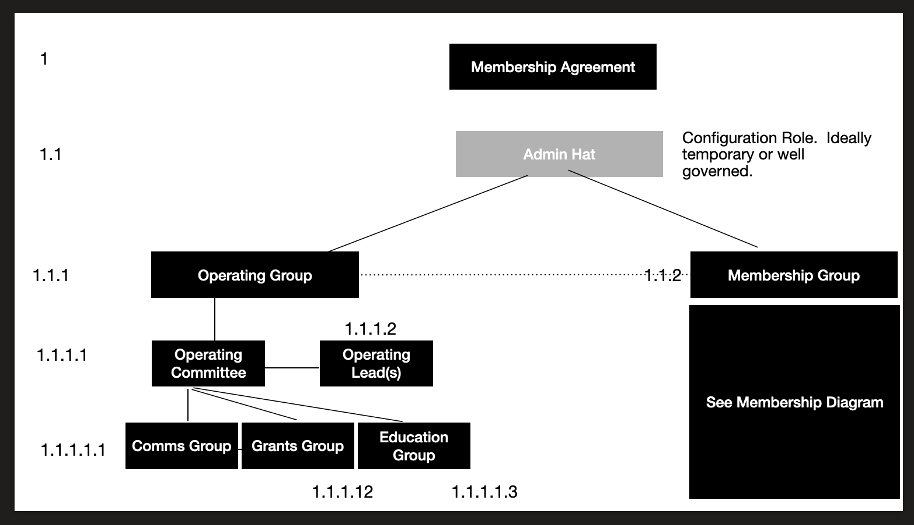
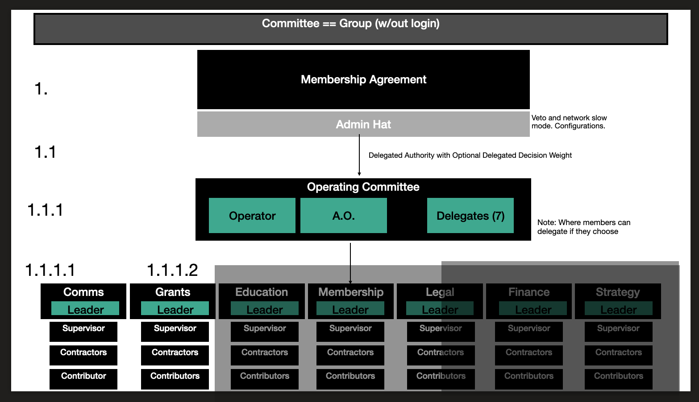
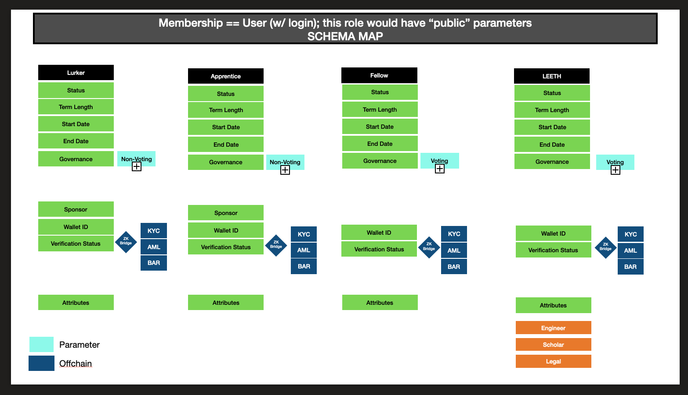

# LexDAO Organizational Design

## Introduction
As part of the project to set up the 2023 membership tokens, we are aiming to implement an ERC-721 token that sets the underlying infrastructure for permissions to the Network.  At this time, we believe that the 721 token is the single most appropriate token available to satisfy the natural case of a person demonstrating membership.  In this demonstration, the 721 contract will store the expiration date within its store values which allows the member to pay and renew the same token indefinitely.  The on-chain store of values will provide us with a continuity graph to be able to identify key patterns in user behavior over time in clusters.

This 721 base will allow us to also issue credentials and additional manner of Proof Of [Insert Proof] Protocol NFTs.  For the purposes of this ecosystem, credentials are the most viable and significant at the moment, but that is a natural conclusion in the context of a membership oriented professional association.  One might imagine, for example, a credential issued by LexDAO for a minimum level of engineering knowledge (LEETH), professional expertise/contribution, work completed, CLE credits, and more.  

The beauty of implementing a 721 structure for these user based roles, is that we can use these certificates to signal behavior to the organizational network which is powered by an 1155 contract.  This 1155 structure is the most basic of permission structures, spinning up a virtual public machine, similar to a local home server network.  The user roles and groups can be defined at this level with increasing levels of sophistication as the network matures.  The entirety of the network self implements a certificate/ssh adjacent structure that preserves the hierarchy and permissions of the network as well as allowing it to identify and interact with other 1155 nodes along a subnet (in theory).

The 1155 will bind with the 721 and create a key value pair that intiates the preliminary access to a single level of the organization (in phase 1), and later to possibly many levels of the organization by way of badges.  Because we can programmatically manipulate store values in the token contract, the NFT itself can remain immutable in the user's wallet while the on chain representation changes by way of the administrator function calls.

Our infrastructure MVP will aim to satisfy the base cases of the membership requirements referenced in the [membership tokens specifications draft](https://github.com/cimplylimited/LexDAO-MembershipToken-2023).  It will also make a concerted effort to trace the [LexDAO Constitution](https://github.com/lexDAO/LexDAO-Constitution/blob/master/LexDAO-Constitution%20v02.md).

## Concept Development

## Key Considerations
Our current structure aims to use the [Unlock Protocol](https://unlock-protocol.com/) and [Hats Protocol](https://www.hatsprotocol.xyz/) for our ERC-721 and ERC-1155 structure, respectively.  For the ERC-721 framework, the expiration of memberships will be manipulated through store values in the contract rather than in the file metadata of the NFT.  This will create a permanent artifact and the NFT will remain in the user wallet *after* expiration.  

## Technical Challenges
In order for the 1155 to interact properly with the 721, we will need help from Hats to develop and deploy hooks to read the store value rather than simply looking for the presence of the NFT.  We will need the Hats contract to recognize the expiration parameter to determine eligibility for the initial gateway to the network.

## Key Partners
This effort would not be possible without the key partnership and contributions of...**fill in**

### Julien

### Chris

### Spencer Graham 
 * implementation, smart contract development, and support
 * Hats Protocol: Co-founder & Protocol Lead Hat Wearer
 * Previous work: core contributor to DAOhaus, member of Raid Guild, MetaCartel, and groundw3rk, contributor to clr.fund

### Nick Naraghi (nintynick) 
 * implementation, support, and stakeholder education
 * Hats Protocol: Co-founder, Strategy Lead Hat & Growth Lead Hat Wearer
 * Previous work: co-founder of EvenGov DAO, member of Raid Guild, groundw3rk, DIA, co-founder of an AI startup backed by 500 Startups

### David Ehrlichman 
 * implementation, support, and stakeholder education
 * Hats Protocol: Co-founder & Ecosystem Lead Hat Wearer
 * Previous work: author of Impact Networks, co-founder of Converge, consultant to 50+ multi-stakeholder collaborations around the world, lead organizer for DAO Camp, founding steward of groundw3rk, contributor to EvenGov

## 1155 Architecture
### Outline

In order for the DAO to work toward progressive decentralization, we will need to adopt additional on chain governance and structure changes.  The foundation of our network architecture must be sound and intentional in its deployment to ensure that the essence of the group manifests accurately in the code.  Currently we have a variety of conflated roles all managed through a sophisticated, but still primative off-chain governance structure.

The next version of the DAO requires a network tree that codifies these network patterns and represents three critical resolutions of the organization with a certificate-oriented role tree.  
> !note
> Currently Draft Material

1. Brand Layer
How does the organization interact with other organizations it owns, partners, or affiliates with?

2. Organization Layer
How do actions manifest in roles and responsibilities throughout the group?  Can we create an agile organizational map that has the capacity to conduct business in both the digital and physical world?  How do we ensure that our brand remains closed but our work remains open?

3.  Users and Groups Layer
How are individuals admitted into the organization?  What is their eligibility?  How can we track their reputation within the organization to grant influence?  How can we reward contributions by granting reputation and thus empowering the reputation of the organization?  What natural barriers can we implement that discourages sybil attacks et. al?    

LexDAO's biggest asset is not money, but the engaged contributions of a brilliant member pool.  Therefore, in an effort to create a platform for people with common interests in Law as a Public Good, we must prioritize informed engagement as the number one criteria for governing the future of the Organization and Brand Layers by the Individuals.
